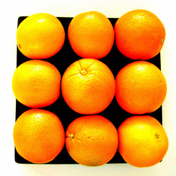
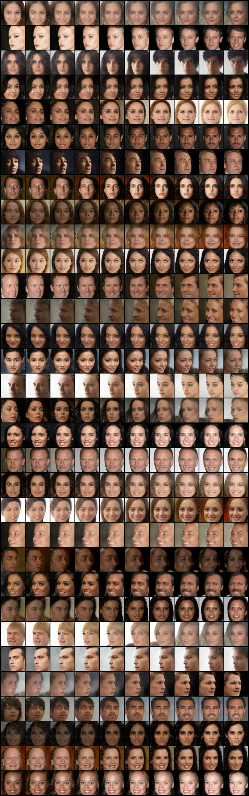
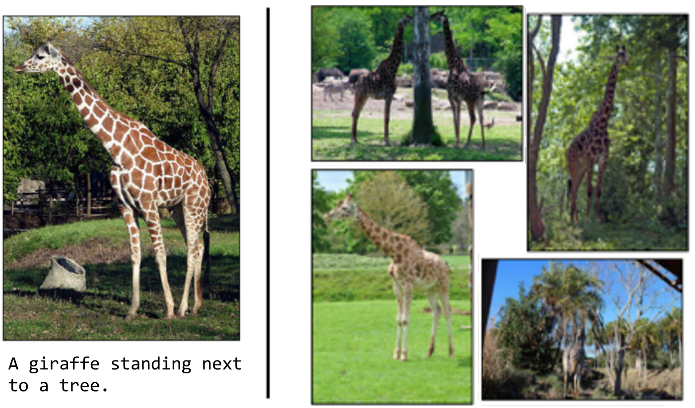

# Python AI Introduction

<!-- TOC -->

- [Python AI Introduction](#python-ai-introduction)
    - [AI example](#ai-example)
    - [Other examples](#other-examples)

<!-- /TOC -->

## AI example

example1: 使用生成对抗网络训练，给定大量苹果和橘子的照片，能把苹果和橘子互相转换。

,

example2: 使用tensorflow实现简易版AlphaGO围棋机器人。可以人机对弈。

example3: 使用深度强化学习训练flappy bird小鸟，能无限通关。

example4: 使用卷积神经网络进行图片风格转换，给定芝加哥城市的照片，能将其转换为糖果风格和梵高风格的图片。

example5: 根据网上搜集的数据，用python数据可视化。

example6: 使用循环神经网络训练，输入哈姆雷特英文小说，能自动创作小说风格的会话。

example7: 使用循环神经网络训练，输入一万多首唐诗，给定开头，就能自动创作唐诗。

example8: 使用循环神经网络生成古典音乐。

example9: 使用卷积神经网络，能把人脸完美转化为另一个人的脸。

example10: 使用循环神经网络训练机器人，能与人对话。

example11: 使用卷积神经网络训练，给定一张图片，自动生成文本描述出图片内容。

example12: 使用卷积神经网络训练，给定一段人活动的视频，能自动识别出人的动作（下楼、上楼、坐、站立等姿势）

example13: 使用python自动收集金融数据并分析、可视化。

## Other examples

机器学习框架scikit-learn, 

监督学习:
- knn算法，线性回归，logistic回归
- 决策树
- 朴素贝叶斯
- 验证码识别

无监督学习:
- 聚类k-means
- tensorflow
- .cnn
- .rnn