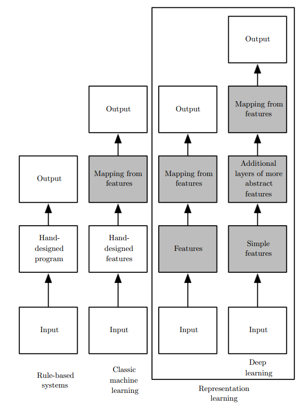
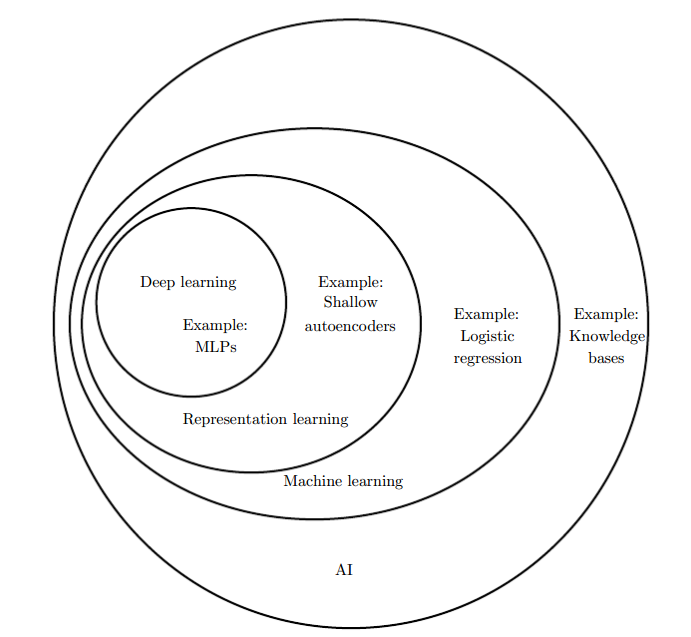
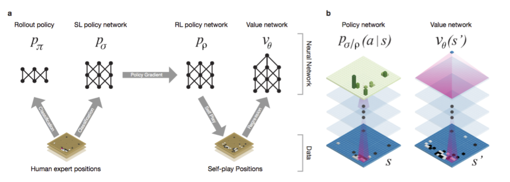

# Chapter

## Introduction

Unpredictable reason:
- randomness: 比如掷骰子、不确定原理
- chaos
- reflectivity: 股市中行为影响预测结果
- network effect
- history dependency

人工智能三个阶段:
> 
- 符号学派(rule-bases systems): 重视逻辑，忽略知识
- 控制学派(classic machine learning)：重视知识，无法学习
- 连接学派(representation learning)：可以自主学习

Classic Machine Learning
- Decision Tree
- Logistic regression
- Bayes
- PCA: principal components analysis, 无监督学习

AI Classification
> 

Machine Learning:
- supervised learning(biggest part):
  - KNN family: 
    - notion of supervise learning
    - square
    - structureed regression
    - bias-variance tradeoff
  - linear regression:
    - linear assumption: gaussian mixture(2vsN) assumption, comapre KNN with linear regression
    - what is feature
    - feature selection:
      - correction
      - distribution-skewness
      - automatic selection
    - lasso & ridge regression:
      - lasso-sparse property
      - when the features are not independent
    - variance-bias paradox
  - linear classification:
    - LDA
    - logistic regression
    - vc dimension, statistical learning theory
    - model vs data complexity
  - neural network:
    - nonlinear
    - universal function approximator
  - SVM:
    - laplace transform
    - nonlinear transform
    - example
  - Native Bayes
  - Graphic models
  - model selection
  - decision tree:
    - tree
      - depth
      - type of data
    - random forest
    - gradient boosting, extreme gradient boosting
- unsupervised learning
- reinforcement learing

Machine Learning:
> 
- Supervised Learning: 有标准答案的即时反馈
- Unsupervised Learning:事先没有任何训练数据样本，需要直接对数据进行建模
- Reinforcement Learning: 积累一段时候之后反馈, 比如小车碰到障碍物训练

## Application

- document classification: 文本分类
- entertainment: netflix
- vision
- speech recognition
- machine translation
- ai designer: 不同脱衣服就可以换衣服
- ai artist
- ai business detection
- finnancial ai report: HFT(high frequency trading), 智能投顾
- agriculture ai
- medicine ai
- detecing earthquake
- game: alpha go

AlphaGo过程:
> 
1. 根据棋谱进行监督学习(图像识别深度学习), 得到"根据当前State → 下一步Action"的SL policy network
2. 利用SL police network进行自我对弈，得到RL policy network
3. 然后利用value network(通过regression实现)判断大局的赢率
4. 将RL和VL加入马尔科夫决策树

AlphaGo 适用条件:
- 目标函数明确
- 规则明确、信息完全
- big data

## Bayes & Stochastic Process

- Bayes Analysis:
  - 条件概率
    - 主观概率
    - 幸存者偏差
  - 贝叶斯公式
  - 贝叶斯统计
  - 贝叶斯决策
  - 朴素贝叶斯

Stochastic Process:
- 随机变量
- 各类分布函数
- wiener process
- possson process
- levy process
- monte cario simulation
- 马尔科夫链
- 稳态过程

Complexity ruins predicatability(非线性动力学)
- Randomness
- Chaos
- Reflectivity: 存在反馈，e.g. 买卖股票导致股票涨跌
- Network Effect
- History Dependency